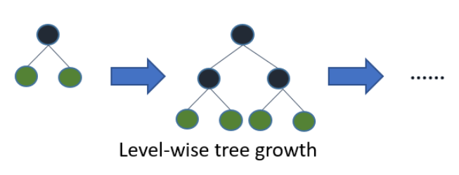

# Machine Learning

### 목차

> 1. Bagging & Boosting
> 2. Adaptive Boosting & Gradient Boosting
> 3. GBM (Gradient Boosting Machine)
> 4. LightGBM

[//]: # (> 4. XGBoost)

---
## Bagging & Boosting ~~& Pasting~~

다양한 분류기를 만드는 방법
1. 각기 **다른** 훈련 알고리즘을 사용하기
2. 훈련 세트의 서브셋을 **무작위**로 구성하여 하나의 분류기를 다르게 학습시키기

이 때 두번째 방법에서 중복을 허용해서 샘플링하는 것이 **배깅**(Bagging, Bootstrap aggregating), 중복을 허용하지 않는 것이 **페이스팅**(pasting)이다. 배깅만이 같은 훈련 샘플을 여러번 샘플링 할 수 있다.

> **부트스트랩** : 중복을 허용한 리샘플링 (= 복원추출)
> 1) X개의 표본 중 하나를 뽑아 기록하고 다시 제자리에 둔다.
> 2) 이를 n번 반복
> 3) n번 재표본추출한 값의 평균 구하기
> 4) 1 ~ 3번을 R번 반복 (R: 부트스트랩 반복 횟수)
> 5) 평균에 대한 결과 R개를 사용해서 신뢰구간 구하기

이렇게 여러 번 예측을 하면 각각의 결과값을 모아서 새로운 샘플에 대한 예측값을 만든다. 
배깅은 분류 모델에서는 최빈값/최댓값을, 회귀 모델에서는 평균값을 구하는게 일반적이며, 병렬학습이다.

**부스팅**(Boosting)은 weak learner 여러 개를 연결해 strong learner를 만드는 앙상블 기법이다.
한번에 여러 개의 예측기를 만드는 것이 아니라, 이전 예측기의 성능을 보완하는 새로운 예측기를 만들면서 정확도를 높여나간다.

한번 학습이 끝나면 이전 모델이 과소적합했던 (= 정답을 맞추지 못했던) 훈련 샘플에 가중치를 더 높게 주어서 학습하기 어려운 샘플을 더 잘 맞출 수 있도록 하는 것이 부스팅이다.

## Adaptive Boosting & Gradient Boosting
### 에이다 부스트 & 그래디언트 부스팅
**에이다 부스트**(Adaboost)는 여러 개의 *stump를 합쳐서 최종 성능 결과값을 내놓는데 이 때 각각의 stump의 가중치는 모두 다르다. 앞서 말한 대로 분류가 잘못된 샘플의 가중치가 크다.
(*stump : 한개의 노드와 두개의 리프로 이루어진 트리)

> **에이다 부스트**의 알고리즘
> 1. 각 샘플의 가중치는 초기에 1/m으로 초기화
> 2. 첫번째 예측기가 학습되고 가중치가 적용된 에러율 r1이 훈련 set에 대해 계산
> 3. 샘플의 가중치 업데이트 (잘못된 분류 샘플의 가중치가 커짐)
> 4. 모든 샘플의 가중치를 정규화
> 5. 새 예측기는 업데이트 된 가중치를 사용해서 훈련
> 6. 1 ~ 5의 과정을 반복하다가 지정된 예측기 수에 도달하거나 완벽한 예측기가 만들어지면 중단

**그래디언트 부스팅**도 에이다 부스트처럼 이전까지의 오차를 보정하도록 순차학습을 한다.
다만 에이다 부스트처럼 반복할 때마다 샘플의 가중치를 수정하는 것이 아니라, 이전 예측기가 만든 잔여 오차(residual error, 잔차)에 새로운 예측기를 학습시킨다.

> **Random Forest**  
> 다수의 트리를 기반으로 예측하는 앙상블 학습법. Bagging 프로세스를 통해 트리를 만든다.

## GBM (Gradient Boosting Machine)
GBM은 경사 하강법(Gradient descent)을 결합한 새로운 부스팅(Boosting) 알고리즘이다. 
그래디언트 부스팅 머신은 잔차(Residual)에 집중하며, 이 잔차를 최소화하는 과정에서 경사 하강법을 사용하기 때문에 이런 이름이 붙었다.

## LightGBM

**LightGBM**은 XGBoost를 보완하여 나온 알고리즘으로, XGBoost보다 속도가 더 빠르고 메모리 사용량도 더 적지만, 예측 성능은 XGBoost와 거의 같다.
LightGBM은 일반적인 GBM 계열이 균형 트리 분할(Level Wise) 방식을 사용했던 것과 다르게 **리프 중심 트리 분할**(Leaf Wise) 방식을 사용한다.  
이처럼 트리의 균형을 맞추지 않고 최대 손실값을 가지는 리프 노드를 지속적으로 분할해 생성한 규칙 트리는 학습을 반복할수록 균형 트리 분할 방식보다 예측 오류 손실을 최소화할 수 있고 시간도 적게 걸리게 된다.
(LGBM은 카테고리형 피처 자동 변환 및 최적 분할을 지원하기도 한다.)

 

##### 참고)
[bagging 기본 개념과 예시](https://for-my-wealthy-life.tistory.com/16)  
[에이다 부스트와 그라이던트부스팅 비교, 부스팅과 배깅의 차이](https://for-my-wealthy-life.tistory.com/17)  
[GBM](https://yngie-c.github.io/machine%20learning/2021/03/21/gbm/)  
[Gradient Boosting Algorithm의 직관적인 이해](https://3months.tistory.com/368)